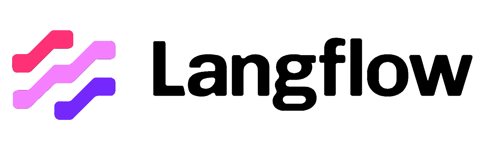

# AI Implementations with LangFlow




This project is a collection of useful Retrieval-Augmented Generation (RAG) and other LLM implementations built with LangFlow. The goal is to provide templates for different use cases, making it easier to implement AI solutions without starting from scratch.

## Table of Contents

- [Overview](#overview)
- [Project Structure](#project-structure)
- [RAG Implementations](#rag-implementations)
- [Getting Started](#getting-started)
- [Prerequisites](#prerequisites)
- [Installation](#installation)
- [Usage](#usage)
- [Contributing](#contributing)
- [License](#license)

## Overview

This repository contains various AI implementation templates using LangFlow, with a focus on RAG (Retrieval-Augmented Generation) patterns. Each implementation is designed to be a standalone template that can be adapted for specific use cases.

## Current Projects

### OllamaChromaDBRAG
Set of two LangFlow models

This implementation combines Ollama embeddings with ChromaDB vector store for creating powerful RAG applications.

Key components:
- **ChromaDBVectorStore-DataLoader.json**: Handles data loading and vector storage
- **OllamaWithEmbeddings-RAG.json**: Implements the RAG pattern using Ollama for embeddings

### OllamaAPIRequest
Mares a GET call to CBR site to get a list of currency rates in XML. Then you may ask questions about currency and rates

Key components:
- **CurrencyAPIRequest.json**: Handles data loading and Ollama requests

## Getting Started

These instructions will help you get started with using the templates in this repository.

### Prerequisites

- LangFlow installed
- Ollama service running
- ChromaDB service accessible
- Python 3.8 or higher (if required by your specific implementation)

### Installation

1. Clone this repository:
   ```bash
   git clone https://github.com/pekt00p/LangFlowProjects.git
   ```

2. Navigate to the desired implementation directory e.g.:
   ```bash
   cd OllamaChromaDBRAG
   ```

3. Import the JSON files into your LangFlow instance

### Usage

1. Open LangFlow in your browser
2. Import the desired JSON template
3. Configure the components as needed for your use case
4. Run the flow

## Screenshots


*Example of LangFlow interface with RAG implementation*


*Configuration of ChromaDB vector store*

## Contributing

Contributions are welcome! Please feel free to submit a Pull Request.

## License

This project is licensed under the MIT License - see the [LICENSE](LICENSE) file for details.